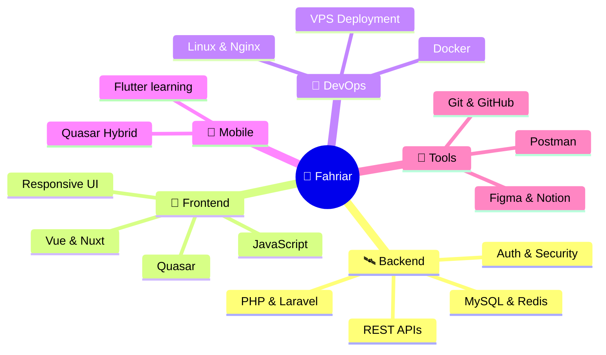

<!-- ═══════════════════════════════════════════════════════════ -->
<!--   🌌  FAHRIAR AHAMMED · FULL-STACK ENGINEER  🌌      -->
<!-- ═══════════════════════════════════════════════════════════ -->

<!-- 🌠 ANIMATED HEADER -->
<picture>
  <source media="(prefers-color-scheme: dark)" srcset="https://capsule-render.vercel.app/api?type=venom&height=260&color=0:0D0D2B,50:1A1A40,100:0D0D2B&text=FAHRIAR%20AHAMMED&fontColor=8A8BFF&fontSize=50&fontAlignY=40&stroke=00E0FF&strokeWidth=1&desc=Full-Stack%20Engineer&descSize=18&descAlignY=62&descColor=00E0FF&animation=fadeIn" />
  
</picture>

<!-- TYPING ANIMATION -->
<div align="center">


<br/>


<br/><br/>

<!-- CONTACT BADGES -->
<a href="mailto:fahriar.ahammed@outlook.com">
  
</a>
<a href="https://wa.me/8801716746328">
  
</a>
<a href="https://linkedin.com/in/fahriar-ahammed">
  
</a>
<a href="https://facebook.com/fahriar.akash">
  
</a>

<br/><br/>


</div>

<br/>

<!-- ═══════════ ✦ DIVIDER ═══════════ -->
<div align="center">
  
</div>

<br/>

<!-- 🪐 PILOT PROFILE -->
## 🪐 Pilot Profile

```yaml
┌─────────────────────────────────────────────────────────┐
│  🛸  PILOT  PROFILE                                     │
├─────────────────────────────────────────────────────────┤
│  name       :  Fahriar Ahammed                          │
│  callsign   :  @Fahriar-Ahammed                         │
│  origin     :  Bangladesh 🇧🇩                            │
│  role       :  Full-Stack Developer                     │
│  domain     :  Backend Systems · Web Apps · SaaS        │
│  stack      :  PHP · Laravel · Vue · Nuxt · MySQL       │
│  exploring  :  Quasar · Flutter · System Design         │
│  motto      :  "Ship clean code into the universe"      │
└─────────────────────────────────────────────────────────┘
```

<br/>

<!-- 🛰️ ABOUT ME -->
## ✦ Transmission From Earth

<table>
<tr>
<td width="58%" valign="top">

> *"I build digital systems the way space missions are engineered — clean, layered, observable, and ready to scale."*

🛰️ **Backend-first developer** crafting scalable Laravel APIs  
🌌 **Frontend explorer** building Vue / Nuxt interfaces  
🔭 **System thinker** focused on architecture, performance & DX  
🚀 **Always learning** — Quasar, Flutter, advanced system design  
💬 **Ask me about** Laravel internals, API design, deployments  
⚡ **Fun fact** — I debug in the dark mode of the universe  

</td>
<td width="42%" valign="top" align="center">


</td>
</tr>
</table>

<br/>

<!-- ═══════════ ✦ DIVIDER ═══════════ -->
<div align="center">
  
</div>

<br/>

<!-- ⌬ TECH CONSTELLATION -->
<div align="center">

## ⌬ Tech Constellation


</div>

<br/>

<!-- ❖ ENGINEERING MODULES -->
## ❖ Engineering Modules

<table width="100%">
<tr>
<th width="50%" align="center">🛰️ BACKEND CORE</th>
<th width="50%" align="center">🌠 FRONTEND ORBIT</th>
</tr>
<tr>
<td valign="top">


```
▰▰▰▰▰▰▰▰▰▱  Laravel APIs        90%
▰▰▰▰▰▰▰▰▱▱  Database Design     85%
▰▰▰▰▰▰▰▰▱▱  Authentication      80%
▰▰▰▰▰▰▰▰▱▱  Business Logic      85%
▰▰▰▰▰▰▰▱▱▱  Performance Tuning  70%
```

</td>
<td valign="top">


```
▰▰▰▰▰▰▰▰▱▱  Vue Components      85%
▰▰▰▰▰▰▰▰▱▱  Nuxt Apps           80%
▰▰▰▰▰▰▰▰▰▱  Admin Dashboards    90%
▰▰▰▰▰▰▰▰▱▱  Responsive UI       80%
▰▰▰▰▰▰▱▱▱▱  Quasar Framework    60%
```

</td>
</tr>
<tr>
<th width="50%" align="center">🚀 DEVOPS · DEPLOY</th>
<th width="50%" align="center">🧰 TOOLBELT</th>
</tr>
<tr>
<td valign="top">


```
▰▰▰▰▰▰▰▰▱▱  VPS Deployment      80%
▰▰▰▰▰▰▰▰▱▱  Nginx / Apache      80%
▰▰▰▰▰▰▰▱▱▱  Docker Setup        70%
▰▰▰▰▰▰▱▱▱▱  CI / CD Pipelines   60%
```

</td>
<td valign="top">


```
▰▰▰▰▰▰▰▰▱▱  Git Workflow        85%
▰▰▰▰▰▰▰▰▱▱  API Testing         80%
▰▰▰▰▰▰▰▰▰▱  Documentation       90%
▰▰▰▰▰▰▰▰▰▱  Problem Solving     90%
```

</td>
</tr>
</table>

<br/>

<!-- ═══════════ ✦ DIVIDER ═══════════ -->
<div align="center">
  
</div>

<br/>

<!-- 🧠 SKILL ORBIT MAP -->
## 🧠 Skill Orbit Map



<br/>

<!-- 📡 MISSION CONTROL -->
## 📡 Mission Control · Focus Matrix

| Sector | Current Module | Trajectory |
|:---:|:---|:---|
| 🛰️ **Backend** | Laravel APIs · auth · domain logic | Queues, caching, Octane, scale |
| 🌠 **Frontend** | Vue/Nuxt dashboards · components | UX systems, Quasar, architecture |
| 🗄️ **Database** | Relational modeling · MySQL | Indexing, profiling, optimization |
| 🚀 **DevOps** | VPS · Nginx/Apache · production | Docker, CI/CD, monitoring |
| 📱 **Mobile** | Quasar · Kotlin foundation | Flutter + Laravel API mobile apps |
| 🧠 **System Design** | Modular SaaS architecture | Resilient, scalable, observable |

<br/>

<!-- 🚀 LEARNING TRAJECTORY -->
## 🚀 Current Learning Trajectory

```
  [ 01 ]  ▰▰▰▰▰▰▱▱▱▱  Quasar Framework          60%
  [ 02 ]  ▰▰▰▰▱▱▱▱▱▱  Flutter Mobile Dev         40%
  [ 03 ]  ▰▰▰▰▰▰▰▱▱▱  Laravel Performance        70%
  [ 04 ]  ▰▰▰▰▰▰▱▱▱▱  System Design @ Scale      60%
  [ 05 ]  ▰▰▰▰▰▱▱▱▱▱  Docker · CI/CD Pipelines   50%
```

<br/>

<!-- ═══════════ ✦ DIVIDER ═══════════ -->
<div align="center">
  
</div>

<br/>

<!-- 🐍 SNAKE ANIMATION -->
<div align="center">

## 🐍 Contribution Snake

<picture>
  <source media="(prefers-color-scheme: dark)" srcset="https://raw.githubusercontent.com/Fahriar-Ahammed/Fahriar-Ahammed/output/github-snake-dark.svg" />
  <source media="(prefers-color-scheme: light)" srcset="https://raw.githubusercontent.com/Fahriar-Ahammed/Fahriar-Ahammed/output/github-snake.svg" />
  
</picture>

</div>

<br/>

<!-- 📊 COSMIC ANALYTICS -->
<div align="center">

## 📊 Cosmic Analytics

<picture>
  <source media="(prefers-color-scheme: dark)" srcset="https://github-readme-stats.vercel.app/api?username=Fahriar-Ahammed&show_icons=true&include_all_commits=true&count_private=true&theme=midnight-purple&hide_border=true&bg_color=0D0D2B&title_color=8A8BFF&icon_color=00E0FF&text_color=FFFFFF&ring_color=8A8BFF" />
  
</picture>
<picture>
  <source media="(prefers-color-scheme: dark)" srcset="https://github-readme-streak-stats.herokuapp.com/?user=Fahriar-Ahammed&theme=midnight-purple&hide_border=true&background=0D0D2B&ring=8A8BFF&fire=00E0FF&currStreakLabel=8A8BFF&sideLabels=FFFFFF&dates=FFFFFF" />
  
</picture>

<br/><br/>

<picture>
  <source media="(prefers-color-scheme: dark)" srcset="https://github-readme-stats.vercel.app/api/top-langs/?username=Fahriar-Ahammed&layout=compact&theme=midnight-purple&hide_border=true&bg_color=0D0D2B&title_color=8A8BFF&text_color=FFFFFF&langs_count=10" />
  
</picture>

</div>

<br/>

<!-- 🌌 ACTIVITY GRAPH -->
<div align="center">

## 🌌 Orbital Activity

<picture>
  <source media="(prefers-color-scheme: dark)" srcset="https://github-readme-activity-graph.vercel.app/graph?username=Fahriar-Ahammed&bg_color=0D0D2B&color=8A8BFF&line=00E0FF&point=FFFFFF&area=true&hide_border=true" />
  
</picture>

</div>

<br/>

<!-- 🏆 ACHIEVEMENTS -->
<div align="center">

## 🏆 Achievement Vault

<picture>
  <source media="(prefers-color-scheme: dark)" srcset="https://github-profile-trophy.vercel.app/?username=Fahriar-Ahammed&theme=darkhub&no-frame=true&no-bg=true&column=7&margin-w=8&margin-h=8" />
  
</picture>

</div>

<br/>

<!-- ═══════════ ✦ DIVIDER ═══════════ -->
<div align="center">
  
</div>

<br/>

<!-- 𓂀 PHILOSOPHY -->
<div align="center">

## 𓂀 Engineering Philosophy

</div>

> **Build clean.** Ship fast. Document everything.  
> Make systems that survive change.  
> Code is craft — write it like the future depends on it.

<br/>

<!-- 📡 CONTACT FOOTER -->
<div align="center">

## 📡 Open a Channel

<a href="mailto:fahriar.ahammed@outlook.com">
  
</a>
<a href="https://wa.me/8801716746328">
  
</a>
<a href="https://linkedin.com/in/fahriar-ahammed">
  
</a>
<a href="https://facebook.com/fahriar.akash">
  
</a>

<br/><br/>


<br/><br/>

<picture>
  <source media="(prefers-color-scheme: dark)" srcset="https://capsule-render.vercel.app/api?type=waving&height=120&color=0:0D0D2B,50:1A1A40,100:0D0D2B&section=footer" />
  
</picture>

</div>
```

---

